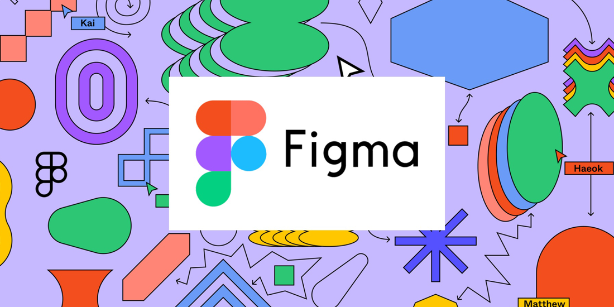
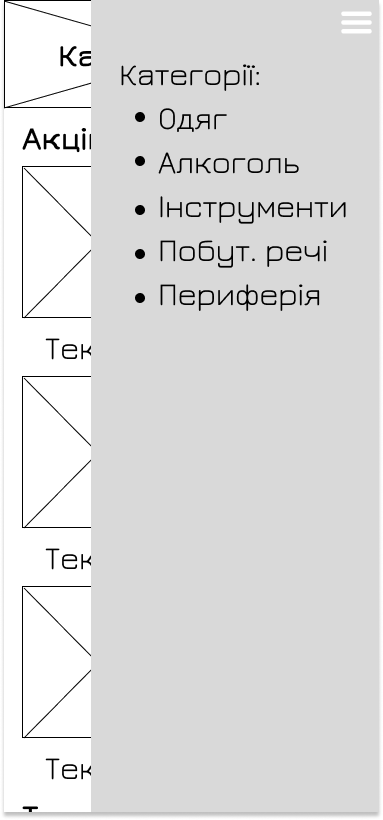
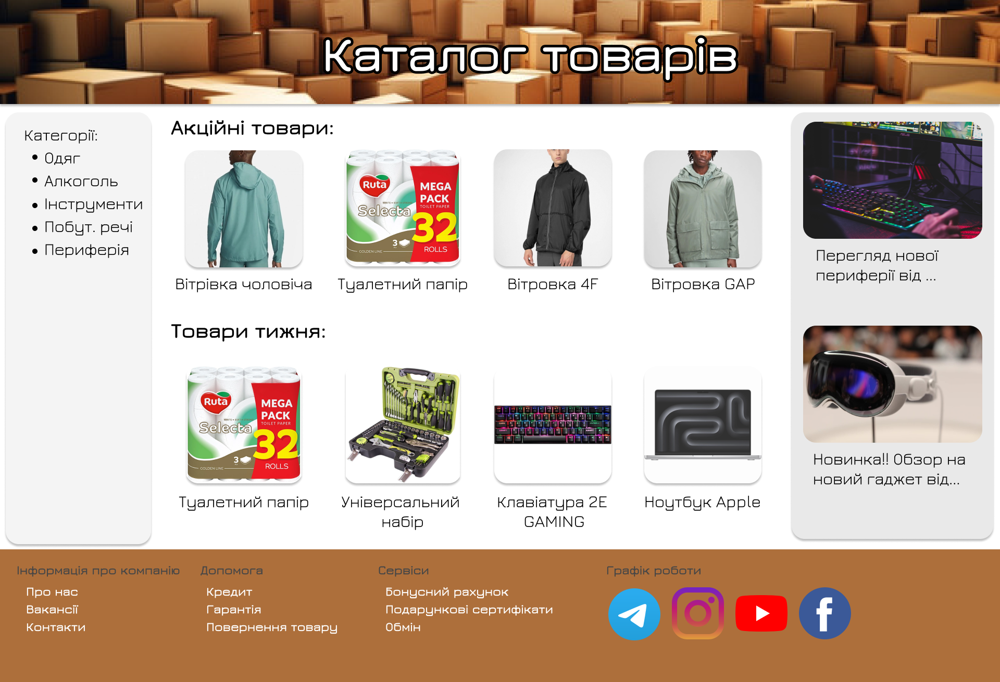

# Створення макету сайту у графічних інструментах

[Перелік усіх робіт](../README.md)

## Мета роботи

Розглянути засоби створення дизайнів користувацьких інтерфейсів сайтів. Навчитись створювати прості та функціональні інтерфейзи засобами Figma

## Обладнання

Персональний комп'ютер. Текстовий редактор Sublime Text 3 або Notepad++. Пакет програм XAMPP. Web-браузер Chrome, Firefox, Opera, MS Edge, web-застосунок Figma

## Теоретичні відомості

Figma - це онлайн-інструмент для дизайну і прототипування, що використовується для створення і редагування інтерфейсів користувача, веб-сайтів, мобільних додатків та інших цифрових продуктів. 

Figma дозволяє дизайнерам працювати в колаборативному середовищі, де вони можуть одночасно редагувати проекти, коментувати їх і спілкуватися з іншими учасниками команди в реальному часі. Цей інструмент також відомий своєю можливістю створення інтерактивних прототипів, що дозволяє випробовувати функціонал продукту перед тим, як розпочати розробку. Figma став популярним серед дизайнерів завдяки своїй зручності, широким можливостям та можливості працювати в хмарі без необхідності встановлення додаткових програм.

Figma має широкий набір інструментів, призначених для дизайну і прототипування, які полегшують процес створення цифрових продуктів. Деякі з основних засобів у Figma включають:

1. Векторні інструменти малювання: Ці інструменти дозволяють створювати різні форми, лінії, контури та інші графічні елементи для розробки інтерфейсу користувача.
2. Робочі дошки і кадри: Figma надає можливість створювати кілька робочих дошок для організації різних частин проекту. Кадри дозволяють створювати відображення сторінок, екранів або станів вашого продукту.
3. Компоненти і бібліотеки: Ви можете створювати компоненти, які можна повторно використовувати у вашому проекті, щоб швидше та зручніше працювати над дизайном. Бібліотеки дозволяють зберігати ці компоненти, а також стилі, кольори та інші ресурси для спільного використання у всій команді.
4. Прототипування: Figma має вбудовані інструменти для створення інтерактивних прототипів, які дозволяють випробовувати функціонал вашого продукту, включаючи переходи між сторінками та взаємодію з елементами інтерфейсу.
5. Колаборація: Одним з ключових аспектів Figma є можливість спільно працювати над проектами в реальному часі. Користувачі можуть бачити зміни, які роблять інші учасники команди, коментувати їх і спілкуватися через чат прямо у програмі.

### Прототип сторінки (мокап)

Мокап сторінки - це спрощене представлення майбутньої веб-сторінки або додатку, яке демонструє розташування елементів на сторінці та їх функціонал. Мокапи сторінок використовуються для того, щоб візуалізувати інтерфейс користувача перед створенням остаточного дизайну.

Прототип сторінки - це інтерактивна модель або представлення майбутньої веб-сторінки або додатку. В деяких випадках, прототипом можуть називати мокап - прототип без інтерактивної складової.

У прототипі сторінки можуть бути відображені такі елементи:

- Розташування текстового контенту.
- Графічні елементи, такі як зображення, ілюстрації, логотипи тощо.
- Функціональні елементи, такі як кнопки, форми, меню, посилання тощо.
- Елементи навігації, такі як меню, панелі інструментів, пошукові поля тощо.

Прототип сторінки дозволяє дизайнерам та розробникам випробувати ідеї, визначити потенційні проблеми в інтерфейсі користувача та зробити необхідні корективи ще до початку фактичної розробки. Також прототипи сторінок можуть використовуватися для залучення замовників або інших зацікавлених сторін до процесу виробництва, демонстрації концепцій та отримання зворотного зв'язку.

### Дизайн сторінки

Дизайн сторінки - це результат створення вигляду інтерфейсу окремої веб-сторінки або екрану додатку з метою забезпечення зручного і привабливого користувацького досвіду. Дизайн включає в себе розташування елементів, вибір кольорів, шрифтів, графіки та інших дизайнерських рішень для створення естетично привабливого та функціонального інтерфейсу.

Ключові елементи дизайну сторінки включають в себе:

- Визначення місця для текстового контенту, зображень, відео та інших медіа-елементів на сторінці.
- Вибір шрифтів, розмірів, кольорів та стилів тексту для забезпечення читабельності і привабливого вигляду текстового контенту.
- Визначення кольорів фону, тексту, кнопок та інших елементів для створення гармонійного та привабливого вигляду сторінки.
- Додавання ілюстрацій, фотографій, іконок та інших графічних елементів для підкреслення та доповнення контенту сторінки.
- Створення кнопок, меню, форм, панелей інструментів та інших елементів навігації та взаємодії, які дозволяють користувачам взаємодіяти зі сторінкою чи додатком.

Дизайн сторінки має за мету не лише естетичний вигляд, але й забезпечення зручності та ефективності користувацького досвіду, сприяючи досягненню цілей, що стоять перед веб-сайтом чи додатком.

## Хід роботи

1. Перевірити доступність інтернет-з'єднання на вашому комп'ютері
2. Створити обліковий запис на [figma.com](https://www.figma.com/)
3. Створити новий проект
4. Створити двохколонковий прототип сторінки та прототип мобільної версії. Тему сторінки обрати на основі завдань, розглянутих в попередніх лабораторних роботах або обрати одну з тем, наданих нижче.
4. Створити трьохколонковий прототип сторінки та прототип мобільної версії. Тему сторінки обрати на основі завдань, розглянутих в попередніх лабораторних роботах або обрати одну з тем, наданих нижче.
5. Зробити дизайн на основі прототипів, створених у попередніх завданнях
6. Для виконання роботи використовуйте приклади з теоретичних відомостей
7. Експортувати створені прототипи та дизайни у растворі зображення
8. Додати експортовані зображення у звіт та зробити короткий опис до них
9. Проєкти у Figma зробіть доступними та додайте на них посилання в кінці звіту
10. Зберегти звіт у форматі PDF
11. Роздрукувати звіт та письмово відповісти на контрольні запитання

## Контрольні питання

1. Що таке Figma і які цілі він вирішує?
2. Які переваги користування Figma для дизайнерів?
3. Яка основна функціональність Figma для створення дизайну?
4. Як створити прототип в Figma?
5. Як Figma допомагає у колаборації з іншими членами команди?
6. Які інструменти для малювання доступні у Figma?
7. Які можливості є для імпорту та експорту графічних файлів у Figma?
8. Чи можна використовувати Figma без підключення до Інтернету? Чому?

## Можливі теми для виконання роботи

1. Сторінка з рецензією на книгу
2. Сторінка з рецензією на фільм
3. Сторінка з рецензією на комп'ютерну гру
4. Сторінка з рецензією на настільну гру
5. Сторінка з рецензією на театральну виставу
6. Сторінка з рецензією на товар
7. Сторінка каталогу товарів
8. Сторінка дошки об'яв
 