# Створення інтерфейсів за допомогою фреймворку Bootstrap
## Перелік лекцій
1.  [Структура HTML-документа і елементи розмітки заголовка документа](lec-01.md)
2.  [Безпека інформації в мережі Internet](lec-02.md)
3.  [Контейнери тіла документа. Таблиці](lec-03.md)
4.  [Використання стилів CSS для налаштування зовнішнього вигляду документу](lec-04.md)
5.  [Основи блочного верстання документів](lec-05.md)
6.  [Основи адаптивної верстки](lec-06.md)
7.  [Створення інтерфейсів за допомогою фреймворку Bootstrap](lec-07.md)
8.  [Створення мобільних інтерфейсів за допомогою фреймворку Bootstrap ч. 2](lec-08.md)
9.  [Типи даних та перетворення типів](lec-09.md)
10.  [Конструкції мови JavaScript](lec-10.md)
11.  [Створення користувацьких функцій](lec-11.md)
12.  [Об'єкти та методи у мові JavaScript](lec-12.md)
13.  [Об'єктна нотація JSON](lec-13.md)
14.  [Технологія асинхронного обміну даними AJAX](lec-14.md)
15.  [Бібліотека jQuery](lec-15.md)
16.  [Плагіни бібліотеки jQuery](lec-16.md)


## Зміст лекції

1.  [Склад фреймворка](#h01)
2.  [Колонкова система](#h02)
3.  [Типографіка](#h03)
4.  [Сповіщення (alerts)](#h04)
5.  [Навігація](#h05)
6.  [Форми](#h06)
7.  [Іконочний шрифт](#h07)
8.  [Як підключити](#h08)
9.  [Стилі для текстів (Typography)](#h09)
11.  [Таблиці (Tables)](#h011)
16.  [Теми для самостійного вивчення](#h016)
17.  [Контрольні запитання](#h017)

## Склад фреймворка


**Bootstrap** — це CSS/HTML-фреймворк для створення сайтів. Іншими словами, це набір інструментів для верстки. У ньому є ряд переваг, завдяки яким BS вважається найпопулярнішим серед собі подібних. Переваги бутстрапа:

1.  **Швидкість роботи** — завдяки безлічі готових елементів верстка з бутстрапа займає значно менше часу;
2.  **Масштабованість** — додавання нових елементів не порушує загальну структуру документів;
3.  **Легко налаштовувати** — редагування стилів проводиться шляхом створення нових css-правил, які виконуються замість стандартних. При цьому не потрібно використовувати атрибути типу “! important”;
4.  **Велика кількість шаблонів** — про шаблони Bootstrap я напишу далі;
5.  **Величезне співтовариство розробників**;
6.  **Широка сфера застосування** — Bootstrap використовується в створенні тем для практично будь-яких CMS (OpenCart, Prestashop, Magento, Joomla, Bitrix, WordPress і будь-які інші), в тому числі для односторінкових додатків.  
    Особливою популярністю користується Bootstrap для створення однострорінкових або лендингів (landing page).

Потрібно зауважити, що бутстрап — це скоріше набір з трьох фреймворків: css/html, js-компонентів і **іконочного шрифту**.

## Колонкова система

Блокова система в Bootstrap — основа грамотної верстки, потужний інструмент для блочного каркасу блоків контенту і будь-яких вкладених елементів. За допомогою префіксів ми можемо вказувати, як потрібно міняти відображення блоків в залежності від типу пристрою, на якому відображається сайт.

Наприклад, клас `.col-xs-` буде використано для телефонів з шириною екрану менше 768 пікселів, а `.col-lg-` — для будь-яких пристроїв з екраном ширше 1170 px. BS розбиває ширину батьківського блоку на 12 рівних частин, які ми можемо використовувати як завгодно. Частини можна об’єднувати, отримуючи, наприклад, три колонки: дві по 25% `.col-lg-3` і одну на 50% `.col-lg-6`.

Візуально колонки можуть бути сформовані у будь-якій комбінації:

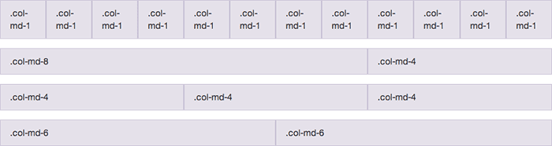

Якщо ви вийдете за межі 12 частин, блоки будуть відображатися один під одним, тому стежте за ними. Ось приклад блоків, які будуть відображатися однаково на всіх пристроях. Ми розділимо екран на три рівні частини:

    <div class="row">
    			<div class="col-sm-4">Перва колонка</div>
    			<div class="col-sm-4">Друга колонка</div>
    			<div class="col-sm-4">Третя колонка</div>
    		</div>

## Типографіка

Крім оформлення блоків і структури сторінки, Bootstrap дозволяє оформити текст: абзаци, цитати, заголовки, підзаголовки, різні розміри тексту, вставки коду тощо У більшості випадків вам не доведеться міняти встановлені за умовчанням параметри тексту, адже все відступи, заголовки, відстані між рядками та інше прописані з точністю як в аптеці.

Чимало уваги приділено і семантиці: основний заголовок можна оформити тегом `<h1>Заголовок</h1>`, а можна і `<div class="h1">Заголовок</div>` — виглядати обидва варіанти будуть однаково, зате другий можна використовувати скільки завгодно разів на сторінці.

Якщо ви хочете спробувати верстати на бутстрапі, але не хочете копатися в чомусь складному, почніть з малого: оформіть текстову сторінку з будь-якої новиною. Розмежуйте заголовок, другорядні заголовки, вставте зображення, кілька цитат, списків і оцініть, як легко цей фреймворк впорається з такими завданнями.

## Сповіщення (alerts)


Будь-яке cповіщення можна оформити в 4-х стандартних форматах: успіх (success), підказка (info), попередження (warning), помилка (danger). Так вони виглядають в житті:

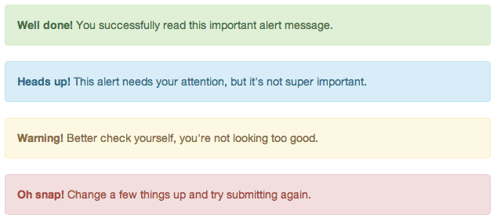

Для оформлення такого повідомлення досить додати два атрибута класу до потрібного об’єкту:

    <div class="alert alert-success" role="alert">Ви успішно дочитали до цього місця</div>
    			<div class="alert alert-info" role="alert">Це ще не кінець статті</div>
    			<div class="alert alert-warning" role="alert">Читати мало, потрібно все застосовувати на практиці</div>
    		<div class="alert alert-danger" role="alert">Так, це не смішно</div>

## Навігація

Навігація — вічна проблема, на якій зазвичай буксує верстка. Грамотно заверстані, оформлені елементи навігації — це одне з найскладніших завдань верстки. У Bootstrap їй приділено окрему увагу: фреймворк має оформлення для табів, посторінкової навігації, вкладок, бокового меню, «хлібних крихт» (breadcrumbs), головного меню, тулбару тощо.

Головне меню легко оформляється в такий вигляд:

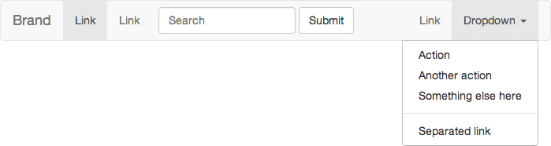

> Щоб зафіксувати головне меню, досить буде додати клас `navbar-fixed`.

Посторінкова навігація виглядає так:

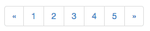

Код для неї буде потрібно такий:
```html
<ul class="pagination">
	<li><a href="#">&laquo;</a></li>
	<li><a href="#">1</a></li>
	<li><a href="#">2</a></li>
	<li><a href="#">3</a></li>
	<li><a href="#">4</a></li>
	<li><a href="#">5</a></li>
	<li><a href="#">&raquo;</a></li>
</ul>
```


Як бачите, нічого складного.

## Форми

Текстові поля і блоки (textarea), кнопки, лейбли, радіокнопки, чекбокси, випадні списки — для всіх елементів форм у бутстрапа є стилі оформлення. Можна оформити вертикальне та горизонтальне розташування елементів і назв, а також підсвічувати частини форми при виникненні помилок або попереджень.

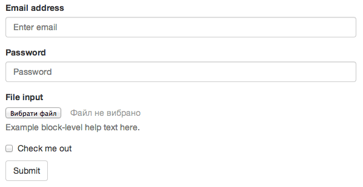

Можна оформити горизонтальне розташування блоків, все поля в один рядок і …

## Кнопки

Тут все просто, щоб оформити кнопку, їй додається потрібний набір класів. Кнопки можуть бути різними:


Код для них такий:
```html
<button type="button" class="btn btn-default">Кнопка</button>
	<button type="button" class="btn btn-primary">Основна</button>
	<button type="button" class="btn btn-success">Успіх</button>
	<button type="button" class="btn btn-info">Інформація</button>
	<button type="button" class="btn btn-warning">Увага</button>
	<button type="button" class="btn btn-danger">Помилка</button>
<button type="button" class="btn btn-link">Посилання</button>
```


## Таблиці

Старі добрі таблиці оформляються шляхом додавання класу `class="table"`. Отримаємо красиво оформлену таблицю:

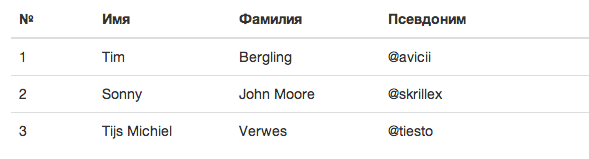

## JS-компоненти

*   Випадні списки,
*   Згортання блоків,
*   Модальні вікна

Крім стилів оформлення у бутстрапа є сценарії поведінки для модальних вікон, слайдера, сплиних підказок, табів та інших інтерактивних елементів сторінки.

Для роботи цих компонентів потрібна jquery, не забудьте переконатися, що вона підключена до `bootstrap.js`.

## Іконочний шрифт

Іконочний шрифт дозволить вам відмовитися від надокучливих спрайтів для іконок і значно спростити собі життя. Єдине обмеження, яке накладає таку спосіб — кожній копії іконки можна призначити тільки один колір.

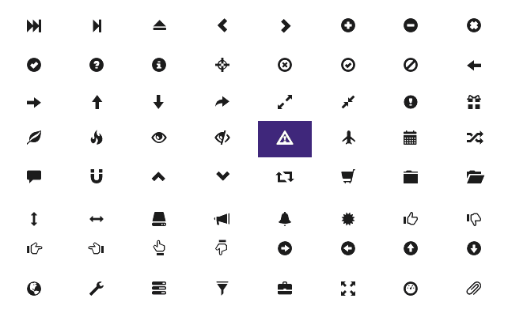

## Як підключити

Заходьте на [офсайт](../../https@getbootstrap.com/customize/default.htm) і виберіть ті елементи, які вам будуть потрібні в роботі. Зайве можна прибирати і додавати за мірою необхідності. Після вибору тиснемо «Compile and Download», отримуємо архів, який розпаковуємо.

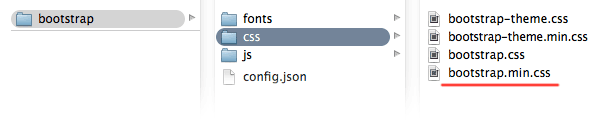

Для базової роботи буде потрібно тільки один файл, він відзначений червоним. Переносите його в папку з вашими css і підключаєте в `<head>` сторінок.

```html
<link rel='stylesheet' href='/css/bootstrap.min.css' type='text/css' media='all'>
```
Іконочний шрифт знаходиться в папці **fonts** і якщо він потрібен, стежте за тим, щоб він в ній і залишався. Дотримуйтесь структуру папок, щоб все працювало як задумано.

## Базові стилі Bootstrap (Common CSS)

Це набір основних елементів, які потрібні для базової верстки. Їх я б рекомендував завжди залишати зазначеними.

## Стилі для друку (Print media styles)

Це стилі, які буде використовувати браузер при підготовці сторінки до друку. Налаштувати їх на свій розсуд ви можете в окремих стилях в такому форматі:
```css
@media print {
				/* ваші стилі */
			}
```


## Стилі для текстів (Typography)

Базове оформлення тексту: відступи, абзаци, цитати, виділення коду, відформатованого тексту, заголовки, під-і надрядковий текст – все це буде оформлено цим набором стилів.

Навіть якщо ви не будете використовувати класи на сторінці, її вміст буде оформлено в bootstrap-стилі . Це зручно для тих випадків, коли ви не можете або не хочете копатися в старому коді. Досить підключити бібліотеку, щоб текст став більш читабельним.

Ось як зміниться звичайний текст без будь-яких додаткових стилів:

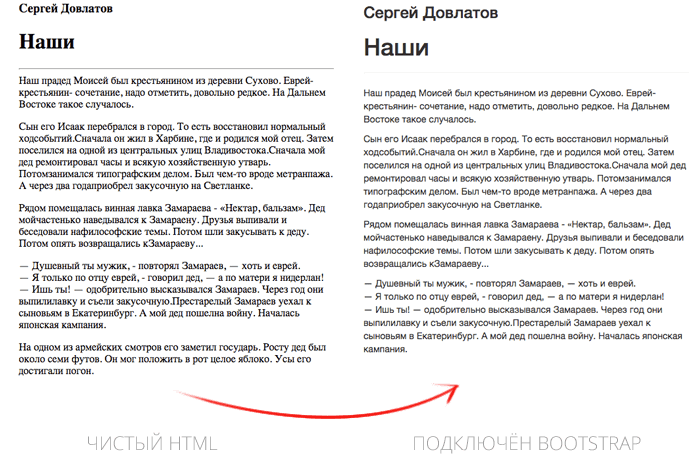

## Оформлення коду (Code)

Оформлення коду на сторінках. Звичайно, тут немає підсвічування синтаксису, для цього доведеться користуватися окремим плагіном (ніяк, до речі, не пов’язаним з бутстрапа), але відрізнити код від звичайного тексту можна буде, уклавши його в тегах `<code>`, `<pre>` або `<kdb>`.


## Таблиці (Tables)

Таблична верстка давно залишилася в минулому, але табличні дані повинні відображатися відповідно, якщо не зазначено інше. Без належного оформлення таблиці виглядають вкрай непривабливо.

Намагайтеся уникати такого:

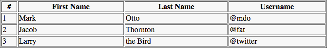

Після простого додавання Bootstrap без змін в html таблиця стане такою:

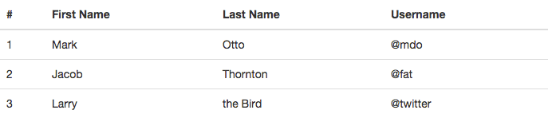


## Теми для самостійного вивчення

1.  Плаваючі об'єкти. Обтікання текстом

## Контрольні запитання

1.  Що таке адаптивне верстання?
2.  Що таке чутливі зображення?
3.  Яким чином можна змінювати розмір зображень?
4.  Які є типм медіазапитів?
5.  За допомогою чого можна працювати тільки з шириною пристрою?