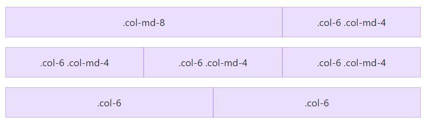
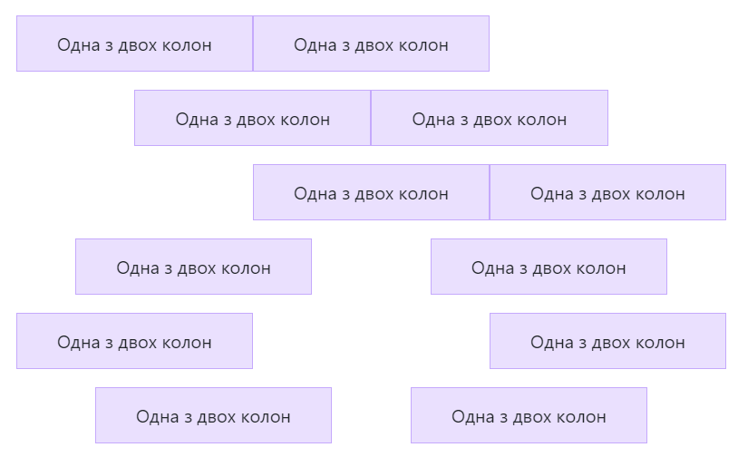
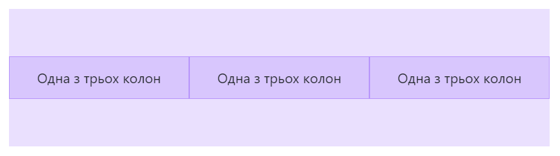

# Макет Bootstrap

[Перелік усіх лекцій](../README.md)

## Точки зупину
Точки зупину – це настроювана ширина, яка визначає, як ваш адаптивний макет поводиться на різних пристроях або розмірах вікна перегляду в Bootstrap.

Bootstrap містить шість контрольних точок за замовчуванням, які іноді називають рівнями сітки , для адаптивної побудови. Ці контрольні точки можна налаштувати, якщо ви використовуєте наші вихідні файли Sass.

| Точка зупину   | Інфікс класу | Розміри        |
| -------------- | ------------ | -------------- |
| Дуже маленький | Жодного      | <576 пікселів  |
| Маленький      | sm           | ≥576 пікселів  |
| Середній       | md           | ≥768 пікселів  |
| Великий        | lg           | ≥992 пікселів  |
| Дуже великий   | xl           | ≥1200 пікселів |
| Дуже великий   | xxl          | ≥1400 пікселів |

Кожну точку зупину було вибрано для зручного утримання контейнерів, ширина яких кратна 12. Точки зупину також представляють підмножину загальних розмірів пристроїв і розмірів вікна перегляду — вони не націлені конкретно на кожен варіант використання чи пристрій. Натомість діапазони забезпечують міцну та послідовну основу для створення майже будь-якого пристрою.

## Контейнери

Контейнери є основним структурним блоком Bootstrap, який містить, вкладає та вирівнює ваш вміст у певному пристрої чи вікні перегляду.

Контейнери є найпростішим елементом макета в Bootstrap і є обов’язковими під час використання сітки за замовчуванням. Контейнери використовуються для розміщення та (іноді) центрування вмісту в них. Хоча контейнери можуть бути вкладеними, більшість макетів не вимагають вкладеного контейнера.

Bootstrap поставляється з трьома різними контейнерами:

- `.container`, який встановлює max-width для кожної відповідної точки зупинки
- `.container-{breakpoint}`, width: 100% до вказаної точки зупинки
- `.container-fluid`, який знаходиться width: 100% на всіх точках зупину

| Дуже маленький  <576 пікселів | Маленький ≥576 пікселів | Середній ≥768 пікселів | Великий ≥992 пікселів | X-Large ≥1200 пікселів | XX-великий ≥1400 пікселів |
|---|---|---|---|---|---|
| .container | 100% | 540 пікселів | 720 пікселів | 960 пікселів | 1140 пікселів | 1320 пікселів |
| .container-sm | 100% | 540 пікселів | 720 пікселів | 960 пікселів | 1140 пікселів | 1320 пікселів |
| .container-md | 100% | 100% | 720 пікселів | 960 пікселів | 1140 пікселів | 1320 пікселів |
| .container-lg | 100% | 100% | 100% | 960 пікселів | 1140 пікселів | 1320 пікселів |
| .container-xl | 100% | 100% | 100% | 100% | 1140 пікселів | 1320 пікселів |
| .container-xxl | 100% | 100% | 100% | 100% | 100% | 1320 пікселів |
| .container-fluid | 100% | 100% | 100% | 100% | 100% | 100% |


## Система 12-колонкової сітки
Сітка Bootstrap - це одна з ключових функцій, яка дозволяє розміщати елементи сторінки в рівномірних колонках на будь-якому розмірі екрану. Вона розділяє сторінку на 12 колонок і надає гнучкість для розміщення контенту на різних пристроях.

Система сітки Bootstrap використовує серію контейнерів, рядків і стовпців для компонування та вирівнювання вмісту. Він створений за допомогою flexbox і повністю реагує. Нижче наведено приклад і докладне пояснення того, як система сітки поєднується.

- Сітка підтримує шість реагуючих точок зупину.
- Контейнери по центру та горизонтально доповнюють ваш вміст.
- Рядки є оболонками для стовпців. 
- Для кожного рядка доступно 12 стовпців шаблону, що дозволяє створювати різні комбінації елементів, які охоплюють будь-яку кількість стовпців. 
- Якщо ви не хочете використовувати попередньо визначені класи сітки в Bootstrap, ви можете використати джерело Sass, щоб створити свій власний.

```html
<div class="container text-center">
  <div class="row">
    <div class="col">
      Column
    </div>
    <div class="col">
      Column
    </div>
    <div class="col">
      Column
    </div>
  </div>
</div>
```


| xs &lt;576 пікселів | см ≥576 пікселів | md ≥768 пікселів | lg ≥992 пікселів | xl ≥1200 пікселів | xxl ≥1400 пікселів |
|---|---|---|---|---|---|
| Контейнерmax-width | Немає (авто) | 540 пікселів | 720 пікселів | 960 пікселів | 1140 пікселів | 1320 пікселів |
| Префікс класу | .col- | .col-sm- | .col-md- | .col-lg- | .col-xl- | .col-xxl- |

```html
<div class="container text-center">
  <!-- Stack the columns on mobile by making one full-width and the other half-width -->
  <div class="row">
    <div class="col-md-8">.col-md-8</div>
    <div class="col-6 col-md-4">.col-6 .col-md-4</div>
  </div>

  <!-- Columns start at 50% wide on mobile and bump up to 33.3% wide on desktop -->
  <div class="row">
    <div class="col-6 col-md-4">.col-6 .col-md-4</div>
    <div class="col-6 col-md-4">.col-6 .col-md-4</div>
    <div class="col-6 col-md-4">.col-6 .col-md-4</div>
  </div>

  <!-- Columns are always 50% wide, on mobile and desktop -->
  <div class="row">
    <div class="col-6">.col-6</div>
    <div class="col-6">.col-6</div>
  </div>
</div>
```



## Горизонтальне вирівнювання
Змініть горизонтальне вирівнювання за допомогою будь-якого адаптивного `justify-content-*` класу.

```html
<div class="container text-center">
  <div class="row justify-content-start">
    <div class="col-4">
      One of two columns
    </div>
    <div class="col-4">
      One of two columns
    </div>
  </div>
  <div class="row justify-content-center">
    <div class="col-4">
      One of two columns
    </div>
    <div class="col-4">
      One of two columns
    </div>
  </div>
  <div class="row justify-content-end">
    <div class="col-4">
      One of two columns
    </div>
    <div class="col-4">
      One of two columns
    </div>
  </div>
  <div class="row justify-content-around">
    <div class="col-4">
      One of two columns
    </div>
    <div class="col-4">
      One of two columns
    </div>
  </div>
  <div class="row justify-content-between">
    <div class="col-4">
      One of two columns
    </div>
    <div class="col-4">
      One of two columns
    </div>
  </div>
  <div class="row justify-content-evenly">
    <div class="col-4">
      One of two columns
    </div>
    <div class="col-4">
      One of two columns
    </div>
  </div>
</div>
```



## Вертикальне вирівнювання
Змініть вертикальне вирівнювання з будь-яким адаптивним `align-items-*` класом.

```html
<div class="container text-center">
  <div class="row align-items-center">
    <div class="col">
      One of three columns
    </div>
    <div class="col">
      One of three columns
    </div>
    <div class="col">
      One of three columns
    </div>
  </div>
</div>
```

